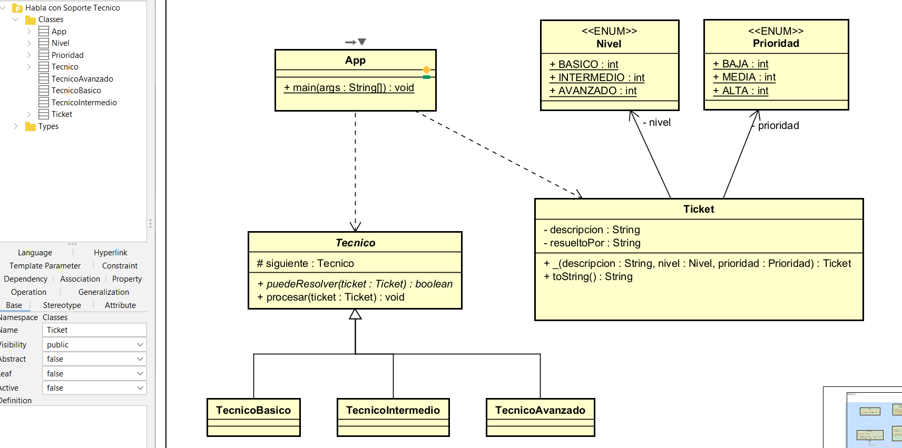

# Reto #6 – Sistema de Soporte Técnico

## 📌 Descripción

Este proyecto implementa un sistema de soporte técnico que procesa tickets de clientes con distintos niveles de dificultad (BÁSICO, INTERMEDIO, AVANZADO) y prioridades (BAJA, MEDIA, ALTA).

Cada ticket es evaluado por una cadena de técnicos.  
Cada técnico intenta resolver el problema según su nivel; si no puede, el ticket se pasa automáticamente al siguiente técnico.

El sistema permite:

- Ingresar múltiples tickets por consola.
- Procesar cada ticket dinámicamente.
- Mostrar qué técnico resolvió cada solicitud.
- Marcar tickets como pendientes si no se pueden resolver.
- Generar estadísticas usando Streams.

---

## 🧠 Patrón de Diseño

### Categoría

**Patrones de Comportamiento (Behavioral Patterns)**

---

## ✅ Patrón Utilizado

### Chain of Responsibility (Cadena de Responsabilidad)

---

## 🎯 ¿Por qué se utilizó este patrón?

El problema requiere que:

- Existan múltiples técnicos.
- Cada técnico pueda o no resolver un ticket.
- Si no puede hacerlo, el ticket debe pasar automáticamente al siguiente.
- El sistema NO debe estar acoplado a un técnico específico.

El patrón **Chain of Responsibility** resuelve exactamente este escenario porque:

- Permite pasar una solicitud a lo largo de una cadena de objetos.
- Cada objeto decide si maneja la solicitud o la delega.
- El emisor del ticket no conoce quién lo resolverá.
- Facilita agregar nuevos técnicos sin modificar el flujo principal.

---


## Diagrama de clases



---

## 🛠 Cómo se aplicó el patrón

1. Se creó una clase abstracta `Tecnico` con:

    - Una referencia al siguiente técnico.
    - Un método `procesar(Ticket)`.

2. Cada técnico concreto (`TecnicoBasico`, `TecnicoIntermedio`, `TecnicoAvanzado`) implementa:

```java
protected boolean puedeResolver(Ticket ticket);
